現在絶賛工事中

# さばねっこのポートフォリオ

回路とか組み込みとかを気ままにやっております。  

Twitter(X):[https://x.com/sabanekko1](https://x.com/sabanekko1)  

ブログ:[https://sabanekko2.hatenablog.com/](https://sabanekko2.hatenablog.com/)  

## つくったものとか

### 2021高専ロボコンの回路  

豊田高専Aチームで出場しました。  
チームメンバーだった気がする。  

### 2022高専ロボコンの回路  

豊田高専Aチームでピットメンバーとして出場しました。  

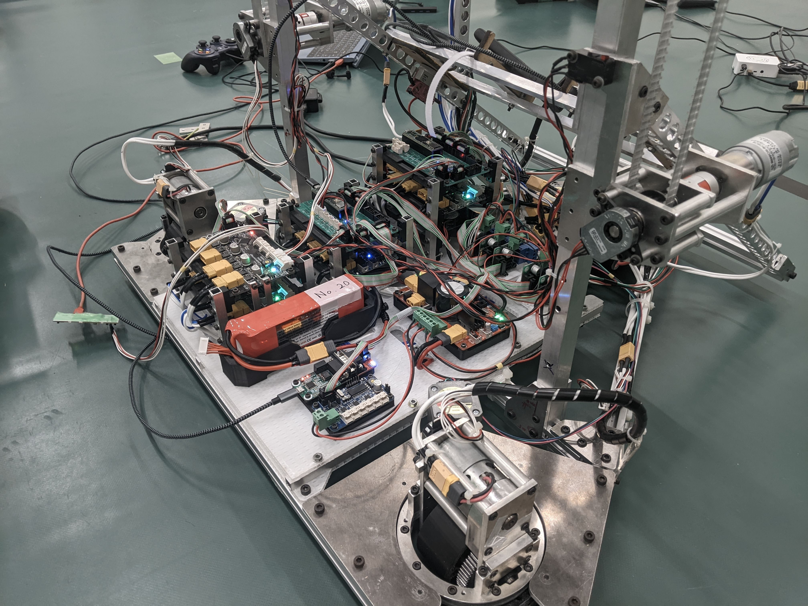
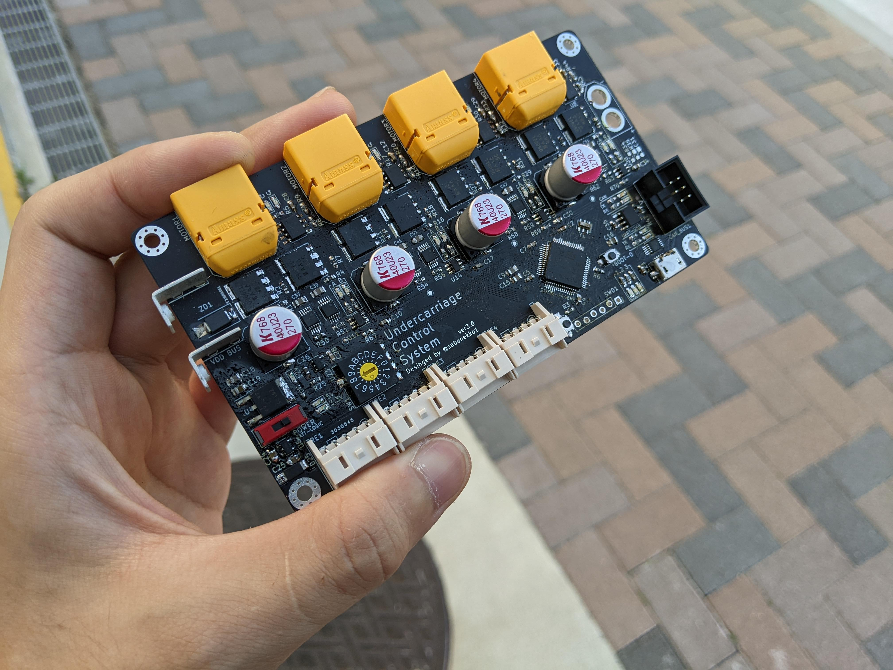
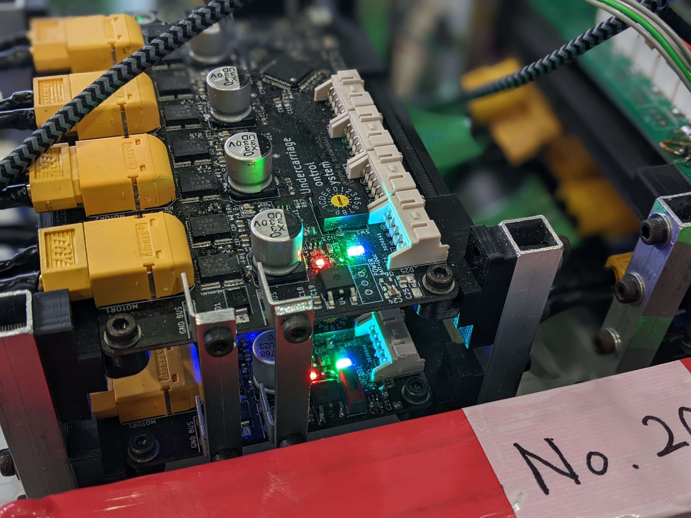

### 2023学生ロボコンの回路

豊田高専RoboSharpでピットメンバーとして出場しました。  

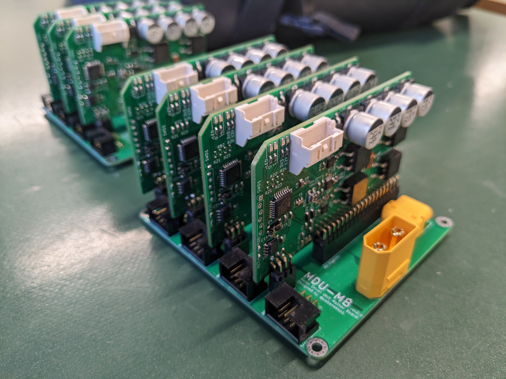
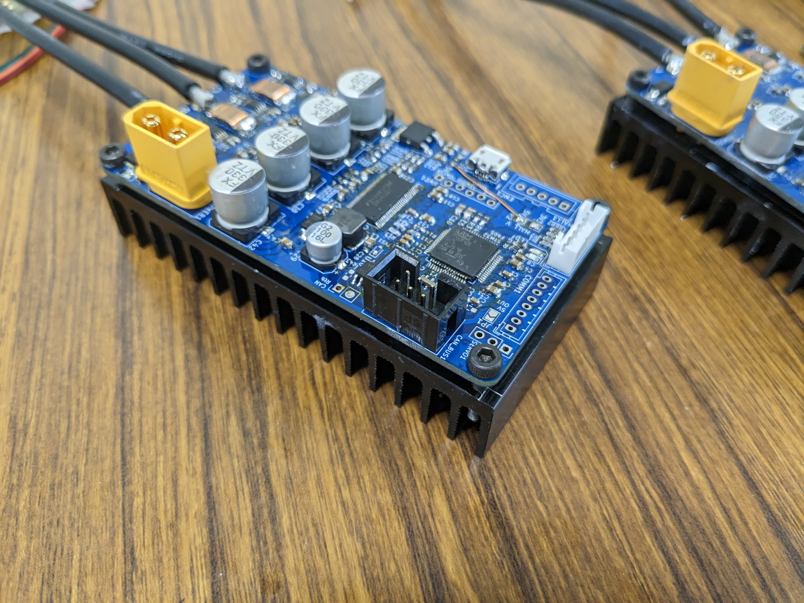

### 2024学生ロボコンの回路

豊田高専TGTでピットメンバーとして出場しました。  

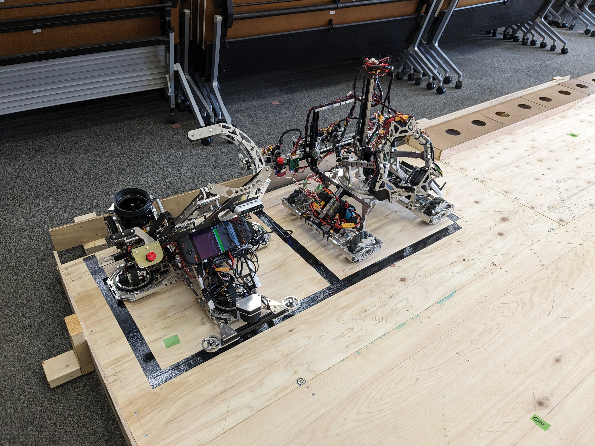

[https://sabanekko2.hatenablog.com/entry/2024/06/12/191351](https://sabanekko2.hatenablog.com/entry/2024/06/12/191351)

### リニアモーターペンプロッタ

自作したリニアモーターでペンプロッタを作ってみました。  

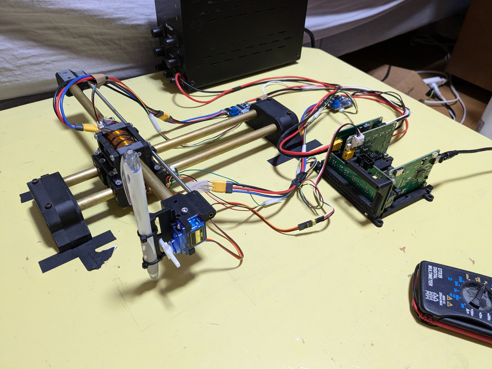

[https://sabanekko2.hatenablog.com/entry/2024/10/24/210847](https://sabanekko2.hatenablog.com/entry/2024/10/24/210847)

### BLDCドライバ

ロボマスモーター（M2006/M3508）の制御もできます。  

### PCBステータ式アキシャルフラックスモータ

プリント基板にコイルパターンをつくってブラシレスモーターを作ってみました。  

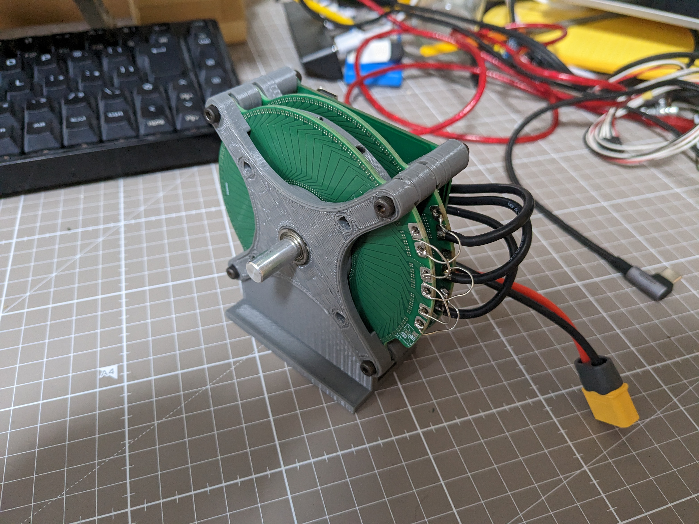

### ポータブル絶縁電源装置  

USB-PDによる給電で動作し、0~20V、150mAを2系統出力できます。  
入力と各出力は絶縁されており、安全に利用可能です。  

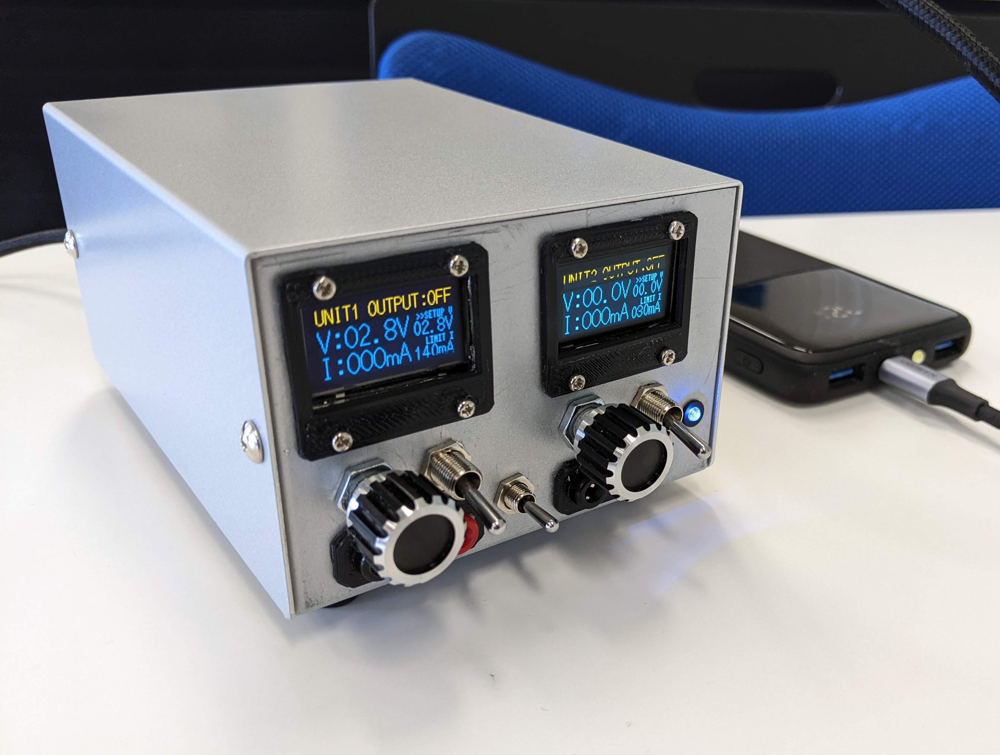

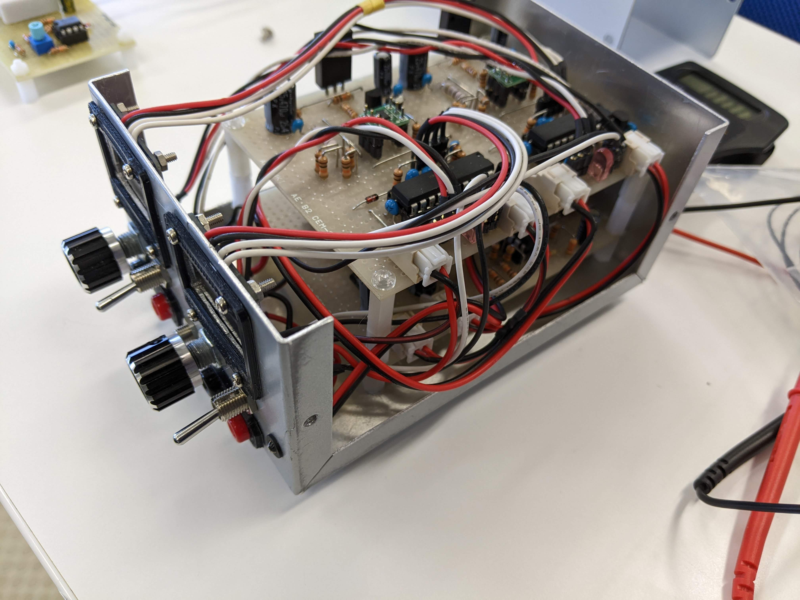

[https://sabanekko2.hatenablog.com/entry/2022/03/24/222924](https://sabanekko2.hatenablog.com/entry/2022/03/24/222924)

### Brainfuckマイコン

Brainfuckで動かせるマイコンをFPGAに実装しました。  
PI制御などの制御も実行可能です。  

### てきとうテスラコイル

他励式SSTC。  
Raspberry Pi Picoを使用した8和音MIDIインタプリタを接続可能。  

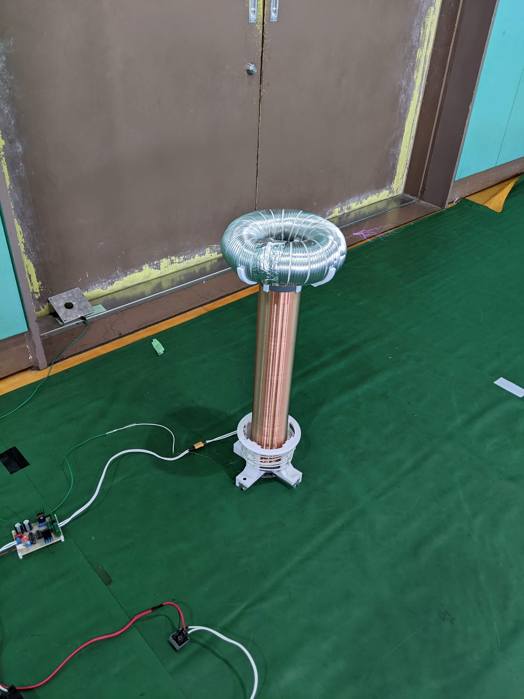